

<h2>What are they?</h2>

<!-- end row-->

 The Supernova is probably the most overlooked and undervalued vintage sewing machine. The Supernovas made in Italy between the 1940s and the late '60s are not only the best Necchis ever made, but one of the best sewing machines ever made, in my opinion.

 Necchi discontinued the Supernova in 1971. The most desired version is the Julia, or model 534. This came with a white vinyl accessory box. Other versions had a hard plastic box with a built-in dial for assisting with stitch selection. Most were flat bed machines, but a free arm version does exist. It is quite scarce (especially in Australia) but I have one but don't go out of your way to buy one: It is definitely not nearly as well designed as the flat bed version. The Automatica was made from 1955-1958, Ultra/Ultra II from 1958-1963, and Julia (534) from 1961-1971. Several models were imported as parts and assembled in Australia. The cams are all interchangeable except the Julia series, which had their own, and aren't compatible with anything else.

<!-- end col 1-->

<figure class="figure">
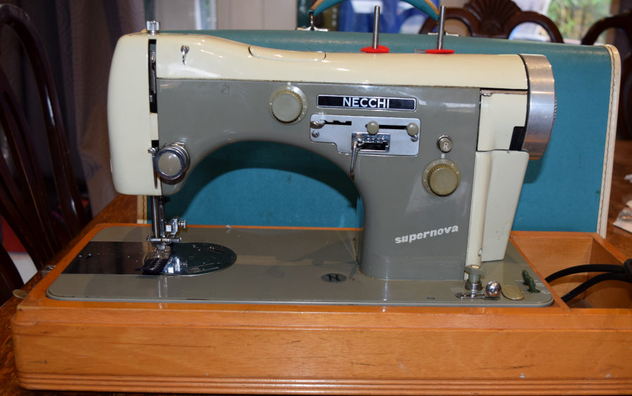
<figcaption class="figure-caption text-end">A Supernova Automatica</figcaption>
</figure>

<!-- end col 2-->

<!-- end row-->

<h2>Why are they great?</h2>

Here are some of the reasons why it's easy to love a Supernova. They are:

<ol>
<li class="has-large-font"> Beautiful. Like most Italian designs, these machines are very easy on the eye.</li>
<li class="has-large-font"> Central bobbin (CB) machines. This is the most flexible type of lockstitch machine. You can use thick thread and big needles (within reason).</li>
<li class="has-large-font"> Extremely smooth and quiet. Typically, European made machines have tighter tolerances, and are more pleasant to use.</li>
<li class="has-large-font"> Extremely powerful.</li>
<li class="has-large-font"> Quite cheap to buy. The one in the picture cost me nothing because it wasn't working.</li>
<li class="has-large-font"> Capable of fully automatic embroidery.</li>
<li class="has-large-font"> They sometimes come with a needle threader.</li>
<li class="has-large-font"> Able to sew a semi-automated buttonhole, with a simple device attached to the pattern mechanism.</li>
<li class="has-large-font"> High shank. You can fit a lot of thickness under the foot.</li>
<li class="has-large-font"> Long bed. They are wider than regular full-sized sewing machines, which makes them a fantastic choice for quilting.</li>
<li class="has-large-font"> They have a left facing bobbin, and an ingenious system that moves the hook with the needle. This keeps the needle-hook distance and the hook timing exactly the same regardless of where the needle is. On other CB machines only the needle moves, so the hook timing changes when the needle is moved. There are a few Japanese manufacturers who copied this system, and they are also noted for their quiet and smooth operation.</li>
</ol>

They resemble the Berninas of the time but with the added embroidery, buttonhole, high shank presser and several other features (e.g. some have automatic needle threading). 
Seems too good to be true, right? Right. Here are some of the reasons they're usually very cheap:

<!-- end col-->

<!-- end row-->

<h2>The bad things</h2>
<ol>
<li class="has-large-font"> They seize up. This is quite a big one. Almost all of the Supernovas I've seen have been left unused for years or even decades and were seized because of that. They have tight tolerances, so any solidified substance, especially oil impurities, will lock it up very tightly. Even if the needle moves up and down easily, if it hasn't been used for a few years it will probably have siezed in one of several other places. </li>
<li class="has-large-font"> Complicated power supply. Light bulbs used in Supernovas are the same as a festoon shaped dome or number plate light bulb in the cars of the time. That is, 12V (AC). This requires a heavy transformer that can output 12VAC, as well as three other AC voltages. They have a voltage selector that is switched to cope with many different input voltages. You could actually see this as a positive but it really adds to the weight issue. The transformer can also fail. You can't use a modern LED festoon bulb because they require a 12V DC supply, although if you insist on using one, it can be done using a bridge rectifier chip such <a TARGET="_NEW" href="https://www.jaycar.com.au/w04-1-5a-400v-bridge-rectifier/p/ZR1304">this one</a>.</li>
<li class="has-large-font"> The suppression capacitor blows up. Although this is very common in vintage machines, it's a bit harder to get to on the Supernova due to the transformer and it isn't obvious how to replace it.</li>
<li class="has-large-font"> They're extremely heavy. I weighed one in its case without accessory box and it was 17.9Kg.</li>
</ol>

<!-- end col 1-->

<figure class="figure">
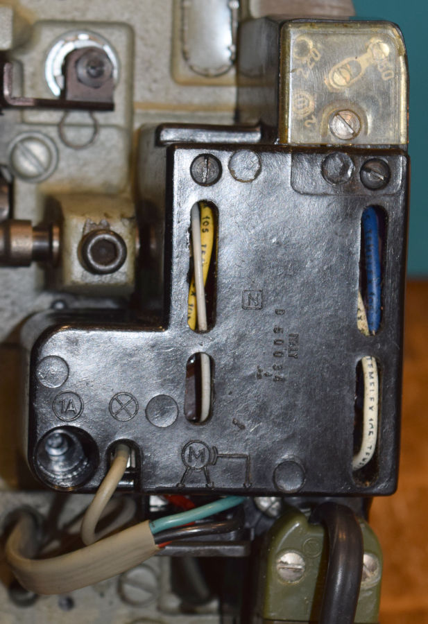
<figcaption class="figure-caption text-end">The voltage selector, top-right, set to 250V
</figcaption>
</figure>

<!-- end col 2-->

<!-- end row-->

<h2>How do I fix the problems?</h2>

 Clearly there is little that can be done about the weight, but the other problems can be solved.
The Seizing is the hardest problem to overcome. Here are the problem areas and some tips. I use a 50:50 solution of mineral turpentine and methylated spirits in a jar to dissolve most dried gunk, and just methylated spirits if I need to use a spray bottle (turps doesn't spray well at all). It was (and still is with some) common for sewing machine mechanics to use WD-40 on sewing machines to free them up. <strong>WD-40 should never be used on a sewing machine</strong> because some of the component chemicals don't evaporate, instead becoming very thick and sticky. This has been the primary cause of a lot of problems with some of my customers' machines. Use a toothbrush and the solvent to scrub at the gunk and lubricate with clean oil afterwards.

<!-- end col -->

<!-- end row -->

<h3>My needle won't swing, baby</h3>

<figure class="figure">
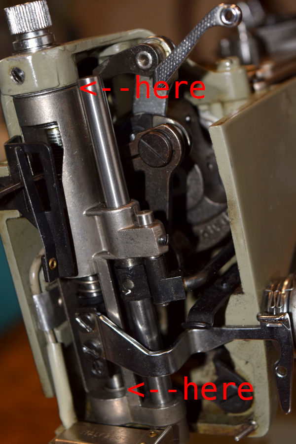
<figcaption class="figure-caption text-start">If you have attempted to move the needlebar and it won't budge, the needlebar frame is seized. This frame pivots in two spots. These two pivot points are prime candidates if the needlebar won't swing. This usually takes a lot of work to free and it must be completely free or the machine will not zig-zag properly. Lubricate the pivot points afterwards with clean oil.</figcaption>
</figure>

<!-- end col 1-->

<figure class="figure">
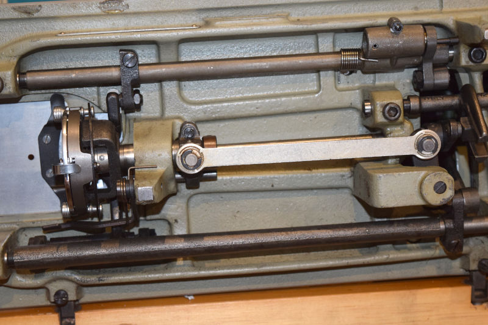
<figcaption class="figure-caption text-end">If the needle will now swing it might still be sluggish. Make sure you also thoroughly clean the bearings that supports the bobbin drive rod and lubricate afterwards.
</figcaption>
</figure>

<!-- end col 2-->

<!-- end row-->

<h3>The needle won't stop moving when I wind a bobbin</h3>

Now comes the hand wheel which is in two parts. When siezed, everything is usually very much stuck in place, meaning you can't remove the whole thing or separate them. You will need a lot of patience with this one, and possibly a couple of home-made tools. I use a home-made tool to force the hand wheel from the machine and from that point separating the component parts is much easier.  
The tool is made from an old steel stop motion screw with a large hole drilled and tapped in the centre so that a bolt can be threaded into it (best to use a lathe to do this or the hole won't be centred).  To use it, replace the original stop motion screw with the tool and extract the hand wheel by winding the bolt into the centre. It should come out pretty easily with the even force of the bolt. After you have extracted the hand wheel, it must easily separate. If it doesn't, you need to get it apart and thoroughly clean the components so that it won't happen again.

<!-- end col 1-->

<figure class="figure">
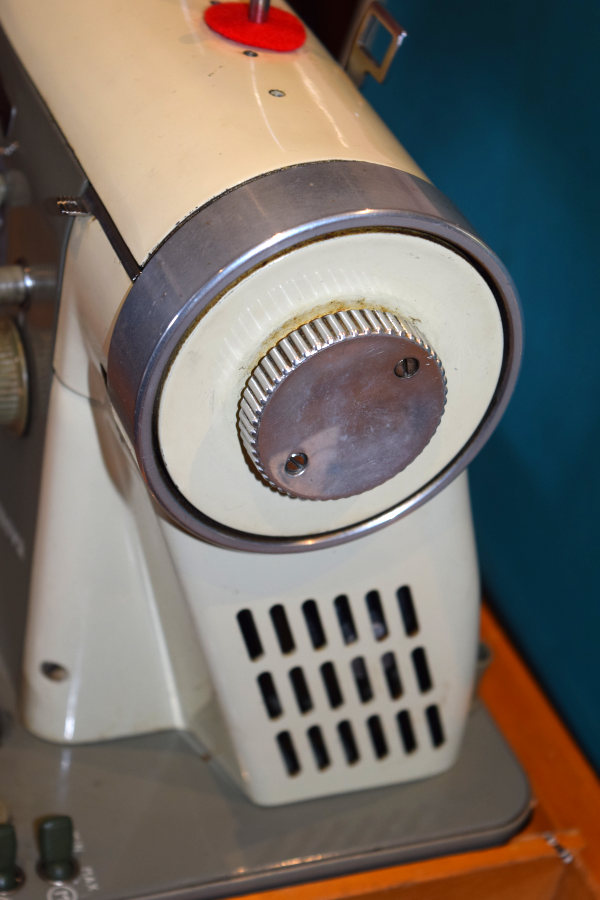
<figcaption class="figure-caption text-end">The hand wheel is usually stuck hard</figcaption>
</figure>

<!-- end col-->

<!-- end row-->

<h3>The capacitor</h3>

The capacitor should be replaced even if it hasn't failed. Capacitors suppress interference by reducing the amount of sparking between the brushes and the armature inside the motor. This has the added benefit of extending the life of the (carbon) brushes. Also, the interference doesn't only affect the AM radio spectrum. If it didn't, manufacturers wouldn't be required to put them in new sewing machines. Here is how to remove the power supply.

<ol>
<li>Remove the power plug.</li>
<li>Remove the screw behind it.</li>
<li>Remove the motor and light wires.</li>
<li>Remove the two darker screws at the top.</li>
<li>Pull the unit toward you and turn it around. The capacitor is obvious: They're usually silver in colour and have three wires. Cut all three wires at the capacitor.</li>
<li>You don't need to replace the green earth wire, so disconnect it at the other end.</li>
<li>The other two wires are grey. Slide a short length of shrink insulation onto each and away from the end. </li>
<li>Expose some of the copper wire.</li>
<li>Solder to a <a TARGET="_NEW" href="https://www.jaycar.com.au/100nf-250vac-metallised-polypropylene-x2-capacitor/p/RG5236">0.1uF X2 poly capacitor</a>.</li>
<li>Shrink the insulation onto the join.</li>
</ol>

New capacitors are designed to last longer than originals, which lasted many decades and since they cost about $1 you will probably never need to do it again.

<!-- end col 1-->

<figure class="figure">
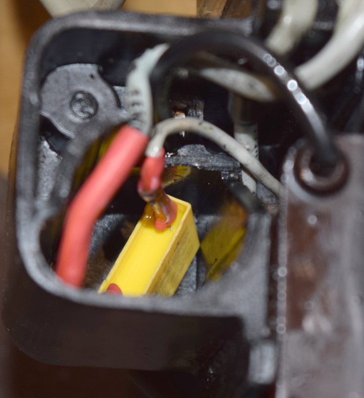
<figcaption class="figure-caption text-end">The PSU. This is after replacement.</figcaption>
</figure>

<!-- end col 2-->

<!-- end row-->

<!-- start row-->

<h3>The Accessories</h3>

Here is the accessory box. It is plastic and has a large wheel incorporated to give you more information about the settings to use with the cams. The case is opened by un-clipping the front and lifting it off.

<!-- end col 1-->

<figure class="figure">
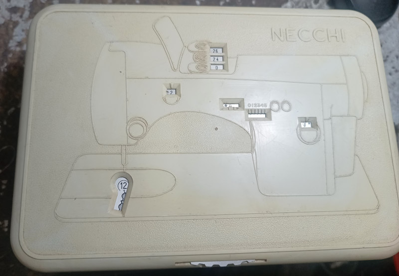
<figcaption class="figure-caption text-end">The accessory case.</figcaption>
</figure>

<!-- end row-->

<!-- start row-->

In the second photo you see the cams. The thing that looks like a bicycle brake lever is actually the buttonhole cam set, and it's sitting next to the buttonhole foot. The cams can clearly be seen at the bottom of the lever. The centre part is of additional cams. These can be mounted on a cam set that has a top that can be unscrewed. You can put the cams in and screw it together. The third section has the cam sets that come with the machine.

<!-- end col 1-->

<figure class="figure">
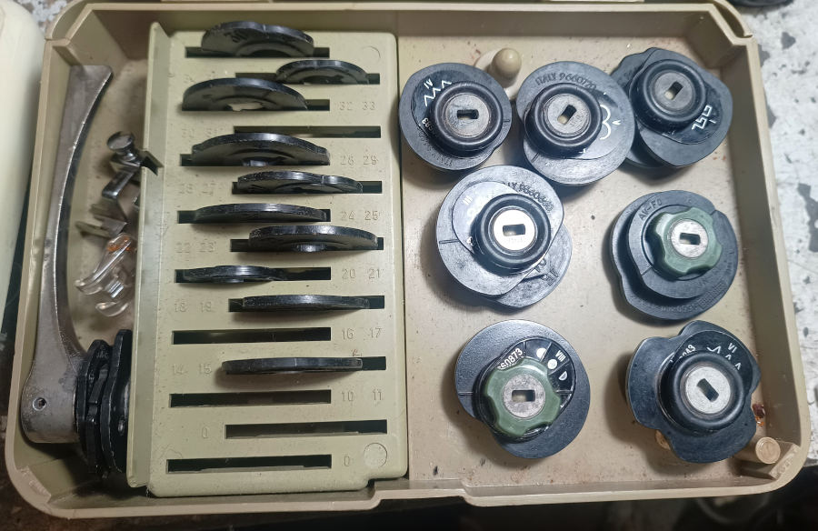
<figcaption class="figure-caption text-end">The central section.</figcaption>
</figure>

<!-- end col 2-->

<!-- end row-->

<!-- start row-->

The third photo shows the bottom layer of the box. You get to it by swivelling the cam layer. This one is quite complete. It was inundated in the 2022 Brisbane flood which explains the rust on the top right section.

The Necchi Supernova accessory box is as brilliantly thought out as the rest of the machine. Everything is there to do practically any sewing job and there's no reason to not keep it together.

<!-- end col 1-->

<!-- start col2-->
<figure class="figure">
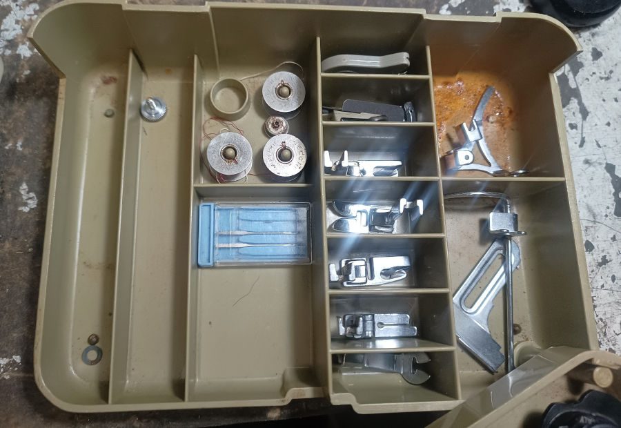
<figcaption class="figure-caption text-end">The bottom section.</figcaption>
</figure>

<!-- end col 2-->

<!-- end row-->

<!-- start row-->

<h3>The Buttonholer</h3>

The buttonholer is a really great idea to make it easy to make a buttonhole automatically using the mechanical cams. It is strongly recommended that you mark out the postion of the buttonhole you want and do at least a couple of trial buttonholes before working on anything important. Here is how to use it:
<ol>
<li> Thread the bobbin case. There is a hole in the bobbin case that the thread should pass through. This is identical to the one used by Bernina, and serves to add a small amount of bobbin tension (without having to manually change the tension) and results in a neater buttonhole (the stitch is locked at the bottom).</li>
<li> Prepare the machine for using cams by pushing the chrome lever (at the rear of the top) back, lift the cam cover and fit the buttonhole foot.</li>
<li> Fit the buttonhole lever and return the chrome lever to its working position.</li>
<li> Make sure that the zig-zag control is at the zero position (the zig-zag will be controlled automatically).</li>
<li> With the lever to the left-most position, start sewing. It will start by sewing forward.</li>
<li> When you have reached the end, stop and click the lever once to the right. Sew the bar tack.</li>
<li> Click again and sew back to the start on the right.</li>
<li> You should be getting the idea now. There are five positions for the buttonhole lever.</li>
</ol>
There is a ruler on the buttonhole foot. Use this to mark the size of the buttonhole so you can match the size. Don't forget to unthread the bobbin case when you've finished.

<!-- end col 1-->

<!-- start col2-->
<figure class="figure">
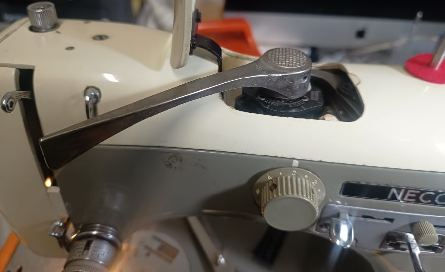
<figcaption class="figure-caption text-end">The buttonholer.</figcaption>
</figure>
<figure class="figure">
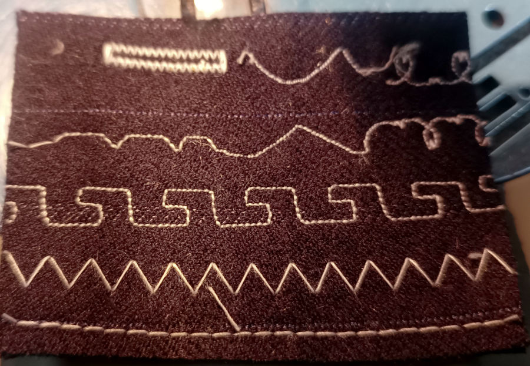
<figcaption class="figure-caption text-end">The buttonhole on the last test swatch.</figcaption>
</figure>

<!-- end col 2-->

<!-- end row-->

<!-- end container -->

